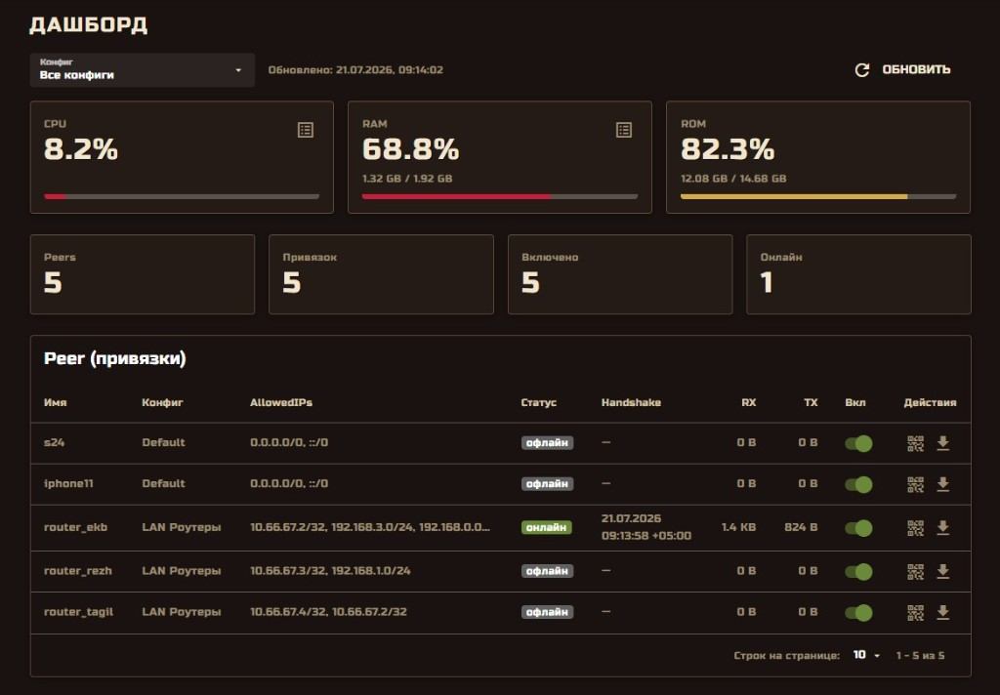
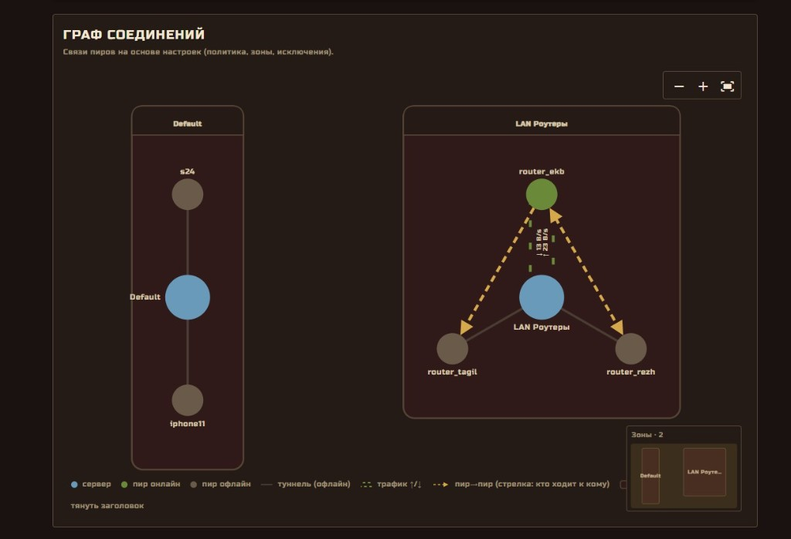

# AmneziaWG GUI (awggui)

**Languages / Языки:** [Русский](README.md) | [English](README.en.md)

AmneziaWG 2.0 VPN server with a Laravel 12 API and Quasar Vue admin panel, all in Docker containers prefixed with `awggui`.

<p align="center">
  
  <br><br>
  
</p>

**License:** [GPL-3.0-or-later](LICENSE) · third-party components: [NOTICE.md](NOTICE.md)

## Quick install (production)

Downloads a pre-built release bundle from GitHub Releases. No source checkout, `node_modules`, or local image build required.

```bash
curl -fsSL https://raw.githubusercontent.com/alt-plus-255/awg-gui/refs/heads/main/dist/install.sh | sudo bash
```

Non-interactive (panel port **8877**, upgrade if already installed):

```bash
curl -fsSL https://raw.githubusercontent.com/alt-plus-255/awg-gui/refs/heads/main/dist/install.sh | sudo bash -s -- --yes
```

Specific version:

```bash
curl -fsSL https://raw.githubusercontent.com/alt-plus-255/awg-gui/refs/heads/main/dist/install.sh | sudo AWG_GUI_VERSION=1.0.0 bash -s -- --yes
```

If `curl` is unavailable, download the script and run it:

```bash
wget --no-config -O /tmp/awg-gui-install.sh https://raw.githubusercontent.com/alt-plus-255/awg-gui/refs/heads/main/dist/install.sh
sudo bash /tmp/awg-gui-install.sh --yes
```

## Features

### Multiple AWG configs

Up to **20** AmneziaWG configs (UDP **51820–51839**): each with its own interface, subnet, and port. Types **Server** (internet VPN) and **Virtual network** (isolated LAN).

→ [Details: configs & peers](readme/en/configs-and-peers.md)

### Peers and rebind

A peer (`vpn_client`) is a separate entity. **Attach** to a config, **detach** (peer stays in the panel), **rebind** to another config. Export **`.conf`** and **QR** for clients.

→ [Details: configs & peers](readme/en/configs-and-peers.md)

### Virtual LANs

Virtual network configs: isolated subnet, “allow all” / “isolation” policies, access zones, peer exclusions, **connection graph** with online status and peer-to-peer traffic.

→ [Details: virtual networks](readme/en/virtual-networks.md)

### Resolver

For **Server** configs (not virtual networks): route traffic by domain and subnet via sing-box — community lists ([allow-domains](https://github.com/itdoginfo/allow-domains)), custom domains and CIDR. Internet exit point is a **Connection** (VLESS, subscription, etc.).

Two routing modes (toggle on each config card on the **Resolver** page):

#### 1. Full tunnel on VDS — default

`AllowedIPs = 0.0.0.0/0, ::/0` · `DNS = gateway`

| Traffic | Route |
|---------|-------|
| **All** client traffic | To VDS (AmneziaWG tunnel) |
| Listed domains (Telegram, YouTube, Meta…) | Via selected **Connection** (sing-box FakeIP → outbound) |
| Everything else (2ip.ru, Speedtest, sites outside lists) | From **VDS server IP** |
| IP-CIDR from community lists | **Fully** proxied |

Use when you want a classic “full VPN via server”, with blocked resources exiting through a separate upstream connection.

#### 2. Split-tunnel — lists only via VDS

> **Test mode.** The feature works but may change; use full tunnel on VDS for production.

`AllowedIPs = 198.18.0.0/15, <gateway>/32` (+ custom subnets) · `DNS = gateway`

| Traffic | Route |
|---------|-------|
| Listed domains (FakeIP) + DNS | Through tunnel → **Connection** |
| **All other** traffic | **Direct from client** (SIM/Wi‑Fi; 2ip.ru = phone IP) |
| IP-CIDR from community lists | **Not** proxied (direct IPs without DNS lookup) |

Use when only listed resources should go through VPN; everything else stays off-tunnel.

**After enabling or changing mode:** delete the server in AmneziaWG and **re-import** QR/`.conf` — lists will not work without re-import.

→ [Details: resolver, diagnostics, re-import](readme/en/resolver.md)

## Documentation

| Topic | Description |
|-------|-------------|
| [Install](readme/en/install.md) | Requirements, production and dev install, upgrade |
| [Uninstall](readme/en/uninstall.md) | Production and dev uninstall |
| [Build release](readme/en/build-release.md) | `./build.sh`, `.run`, GitHub Releases |
| [CLI](readme/en/cli.md) | `awg-gui`: endpoint, password, 2FA, systemd |
| [Webhook](readme/en/webhook.md) | Failure notification JSON schema |
| [Configs & peers](readme/en/configs-and-peers.md) | Multi-config, attach/detach, export |
| [Virtual networks](readme/en/virtual-networks.md) | VN, zones, exclusions |
| [Resolver](readme/en/resolver.md) | Two modes (full tunnel / split), diagnostics, re-import |
| [Project structure](readme/en/project-structure.md) | Directories, Docker containers |

Русский: [readme/ru/](readme/ru/)

## License

The **awg-gui** project (panel source, install scripts, Docker definitions) is licensed under the
**[GNU General Public License v3.0 or later](LICENSE)** (GPL-3.0-or-later).

Release bundles (`.run`) and Docker images include **third-party** software under
**other** licenses — including **GPL-2.0** (amneziawg-tools) and **GPL-3.0** (sing-box, MariaDB).
See **[NOTICE.md](NOTICE.md)** for versions and source links.

### sing-box and branding

The resolver uses [sing-box](https://github.com/SagerNet/sing-box) as a component inside the AWG
container. **awg-gui is not an official sing-box / SagerNet product.** sing-box includes an
additional term: derivative works must not use the sing-box name or imply association without
prior consent from the copyright holder. Details in [NOTICE.md](NOTICE.md).

When redistributing `.run` files or images, comply with GPL obligations: include license text,
`NOTICE.md`, and a way for recipients to obtain GPL source for bundled components (see NOTICE.md).
