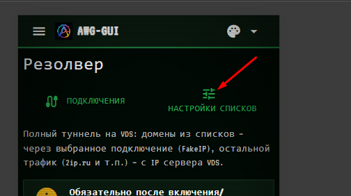
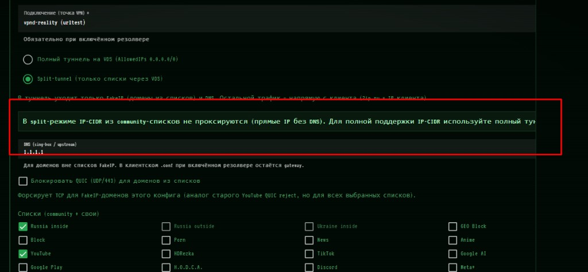

# AmneziaWG GUI (awggui)

**Языки / Languages:** [Русский](README.md) | [English](README.en.md)

AmneziaWG 2.0 VPN-сервер с Laravel 12 API и админ-панелью на Quasar Vue. Все сервисы работают в Docker-контейнерах с префиксом `awggui`.

<p align="center">
  
  <br><br>
  
</p>

**Лицензия:** [GPL-3.0-or-later](LICENSE) · сторонние компоненты: [NOTICE.md](NOTICE.md)

## Быстрая установка (production)

Скачивает готовый release-bundle из GitHub Releases и разворачивает панель. Исходники, `node_modules` и локальная сборка образов **не нужны**.

```bash
curl -fsSL https://raw.githubusercontent.com/alt-plus-255/awg-gui/refs/heads/main/dist/install.sh | sudo bash
```

Без интерактива (порт панели **8877**, при существующей установке — режим обновления):

```bash
curl -fsSL https://raw.githubusercontent.com/alt-plus-255/awg-gui/refs/heads/main/dist/install.sh | sudo bash -s -- --yes
```

Конкретная версия:

```bash
curl -fsSL https://raw.githubusercontent.com/alt-plus-255/awg-gui/refs/heads/main/dist/install.sh | sudo AWG_GUI_VERSION=1.0.0 bash -s -- --yes
```

Если `curl` недоступен, скачайте скрипт и запустите вручную:

```bash
wget --no-config -O /tmp/awg-gui-install.sh https://raw.githubusercontent.com/alt-plus-255/awg-gui/refs/heads/main/dist/install.sh
sudo bash /tmp/awg-gui-install.sh --yes
```

## Возможности

### Несколько конфигов AWG

До **20** конфигов AmneziaWG (UDP **51820–51839**): у каждого свой интерфейс, подсеть и порт. Типы **Сервер** (VPN в интернет) и **Виртуальная сеть** (изолированная LAN).

→ [Подробнее: конфиги и пиры](readme/ru/configs-and-peers.md)

### Пиры и перепривязка

Пир (`vpn_client`) — отдельная сущность. Можно **привязать** к конфигу, **отвязать** (пир остаётся в панели), **перепривязать** к другому конфигу. Экспорт **`.conf`** и **QR** для клиентов.

→ [Подробнее: конфиги и пиры](readme/ru/configs-and-peers.md)

### Виртуальные LAN

Конфиги типа «Виртуальная сеть»: изолированная подсеть, политики «все видят всех» / «изоляция», зоны доступа, исключения между пирами, **граф связей** с онлайн-статусом и трафиком между пирами.

→ [Подробнее: виртуальные сети](readme/ru/virtual-networks.md)

### Резолвер

Для конфигов типа **Сервер** (не для виртуальных сетей): маршрутизация трафика по доменам и подсетям через sing-box — community-списки ([allow-domains](https://github.com/itdoginfo/allow-domains)), свои домены и CIDR. Точка выхода в интернет — **Подключение** (VLESS, подписка и т.п.).

<p align="center">
  
  &nbsp;
  
</p>

Два режима работы (переключатель в настройках конфига на странице **Резолвер**):

#### 1. Полный туннель на VDS — режим по умолчанию

`AllowedIPs = 0.0.0.0/0, ::/0` · `DNS = gateway`

| Что | Куда идёт |
|-----|-----------|
| **Весь** трафик клиента | На VDS (AmneziaWG-туннель) |
| Домены из списков (Telegram, YouTube, Meta…) | Через выбранное **Подключение** (sing-box FakeIP → outbound) |
| Остальное (2ip.ru, Speedtest, сайты вне списков) | С **IP сервера VDS** |
| IP-CIDR из community-списков | **Полностью** проксируются |

Подходит, когда нужен классический «весь VPN через сервер», но с точечным выходом в интернет для заблокированных ресурсов через отдельное подключение.

#### 2. Split-tunnel — только списки через VDS

> **Тестовый режим.** Функционал работает, но может меняться; перед production используйте полный туннель на VDS.

`AllowedIPs = 198.18.0.0/15, <gateway>/32` (+ свои подсети) · `DNS = gateway`

| Что | Куда идёт |
|-----|-----------|
| Домены из списков (FakeIP) + DNS | Через туннель → **Подключение** |
| **Весь остальной** трафик | **Напрямую с клиента** (SIM/Wi‑Fi; 2ip.ru = IP телефона) |
| IP-CIDR из community-списков | **Не** проксируются (прямые IP без DNS-запроса) |

Подходит, когда через VPN нужны только ресурсы из списков, а остальной интернет — без туннеля.

**После включения или смены режима:** удалите сервер в AmneziaWG и **заново импортируйте** QR/`.conf` — без переимпорта списки не заработают.

→ [Подробнее: резолвер, диагностика, переимпорт](readme/ru/resolver.md)

## Документация

| Раздел | Описание |
|--------|----------|
| [Установка](readme/ru/install.md) | Требования, production и dev install, обновление |
| [Удаление](readme/ru/uninstall.md) | Production и dev uninstall |
| [Сборка release](readme/ru/build-release.md) | `./build.sh`, `.run`, GitHub Releases |
| [CLI](readme/ru/cli.md) | `awg-gui`: endpoint, password, 2FA, systemd |
| [Webhook](readme/ru/webhook.md) | JSON schema оповещений о сбоях |
| [Конфиги и пиры](readme/ru/configs-and-peers.md) | Мульти-конфиг, attach/detach, экспорт |
| [Виртуальные сети](readme/ru/virtual-networks.md) | VN, зоны, исключения |
| [Резолвер](readme/ru/resolver.md) | Два режима (полный туннель / split), диагностика, переимпорт |
| [Структура проекта](readme/ru/project-structure.md) | Каталоги, Docker-контейнеры |

English: [readme/en/](readme/en/)

## Лицензия

Проект **awg-gui** (исходники панели, скрипты установки, Docker-описания) распространяется под
**[GNU General Public License v3.0 or later](LICENSE)** (GPL-3.0-or-later).

Release-bundle (`.run`) и Docker-образы содержат сторонние программы с **другими**
лицензиями — в том числе **GPL-2.0** (amneziawg-tools) и **GPL-3.0** (sing-box, MariaDB).
Полный список, версии и ссылки на исходники: **[NOTICE.md](NOTICE.md)**.

### sing-box и брендинг

Резолвер использует [sing-box](https://github.com/SagerNet/sing-box) как компонент внутри
контейнера AWG. **awg-gui не является официальным продуктом sing-box / SagerNet.**
У sing-box есть дополнительное условие: производные работы не должны использовать имя
sing-box или создавать впечатление аффилированности без согласия правообладателя.
Подробности — в [NOTICE.md](NOTICE.md).

При распространении `.run` или образов соблюдайте GPL: предоставляйте текст лицензии,
`NOTICE.md` и возможность получить исходный код GPL-компонентов (см. NOTICE.md).
