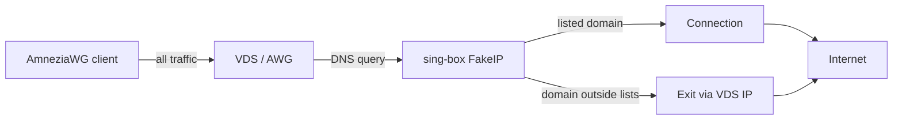

# Resolver

**Languages:** [Русский](../ru/resolver.md) | [English](resolver.md) | [README](../../README.en.md)

The **Resolver** page in AWG-GUI configures routing for **Server** configs. [Virtual networks](virtual-networks.md) do **not** use the resolver.

The resolver is a “smart VPN via VDS”: all client traffic goes to the server (`AllowedIPs = 0.0.0.0/0`), while domains from selected lists exit through a separate **Connection** (VLESS, VMess, subscription, etc.) instead of the VDS IP.

## Panel pages

| Page | Purpose |
|------|---------|
| **Resolver** | Enable resolver on a server config, pick lists, custom domains/CIDRs, connection, DNS upstream, QUIC blocking |
| **Connections** | Internet exit points for sing-box (outbounds) |
| **List settings** | Download community rulesets (`.srs`), sync interval, custom lists |
| **Diagnostics** | Check sing-box, on-disk rulesets, DNS → FakeIP |

## How it works

1. **sing-box** with FakeIP (`198.18.0.0/15`) and rulesets runs inside the AWG container on the VDS.
2. Community lists ([allow-domains](https://github.com/itdoginfo/allow-domains)) are downloaded to disk (`rulesets/*.srs`) — **List settings**.
3. Each server config on **Resolver** picks a **Connection** — upstream for listed domains.
4. The client gets a `.conf` / QR with `DNS = gateway` and `AllowedIPs = 0.0.0.0/0, ::/0`.



## Client config

With the resolver enabled, the `.conf` contains:

```
DNS = <gateway>
AllowedIPs = 0.0.0.0/0, ::/0
```

`<gateway>` is the server address in the AWG subnet (e.g. `10.66.66.1`).

## Traffic routing

| Traffic | Route |
|---------|-------|
| All client traffic | Via AmneziaWG to VDS |
| Listed domains (FakeIP) | sing-box → selected **Connection** |
| Sites outside lists, Speedtest, 2ip.ru | From **VDS server IP** |
| IP-CIDR from community lists | Proxied on VDS |
| Custom subnets (CIDR) | Handled on VDS in sing-box rules |

Use when you want a classic “full VPN via server”, but blocked resources (Telegram, YouTube, Meta…) exit through a separate upstream connection.

## Quick setup

1. **List settings** — download the community lists you need (or create custom ones).
2. **Connections** — add and verify an exit point (VLESS / subscription / …).
3. **Resolver** — expand a server config:
   - enable the resolver;
   - select a **Connection**;
   - pick at least one list, custom domain, or subnet;
   - optionally set DNS upstream and “Block QUIC”;
   - click **Save**.
4. On the phone, **delete** the old AmneziaWG server and **re-import** the QR / `.conf`.

Without re-import, the client may keep old `DNS` / `AllowedIPs` — lists will not work.

## Lists

- **Community lists** — YouTube, Meta, Telegram, Discord, TikTok, etc. Sync in **List settings** (default interval 6 h). **Save** on the Resolver page does **not** download lists over HTTP.
- **Custom domains and subnets** — on the config card on **Resolver**.
- **Mutually exclusive lists** — `russia_inside`, `russia_outside`, `ukraine_inside`: only one from this group can be selected at a time.
- **Block QUIC** — forces TCP for FakeIP domains (UDP/443), useful for YouTube and other listed services.

## Connections

The resolver is **not** applied without a selected, enabled connection. Create a connection on **Connections**, then assign it in the config settings.

## Phone check

| Check | Expected result |
|-------|-----------------|
| 2ip.ru | **VDS** IP, not the client |
| Site / app from a list | Works via the VPN connection |
| `DNS` in `.conf` | Server `gateway` |
| `AllowedIPs` | `0.0.0.0/0, ::/0` |
| Private DNS (Android) | Disabled |
| iCloud Private Relay (iPhone) | Disabled while testing |

Do not test list routing with Speedtest — open a specific site or app from a selected list.

## Diagnostics and common issues

- **Diagnostics** page — sing-box, on-disk `.srs`, DNS → FakeIP for enabled lists.
- **Android:** disable Private DNS / DoH; if Telegram fails, clear the app cache.
- **iPhone:** disable iCloud Private Relay.
- Make sure community lists are downloaded (**List settings** → “On disk”).
- After changing endpoint, UDP port, or resolver settings — re-export / re-import configs on devices.

## sing-box in the AWG image

The resolver uses [sing-box](https://github.com/SagerNet/sing-box) inside the AWG container. Production builds include sing-box in the image; dev builds download the tarball via the installer — see [install.md](install.md#sing-box-vendor-dev-build-only).

License and branding details for sing-box — in [README](../../README.en.md#sing-box-and-branding) and [NOTICE.md](../../NOTICE.md).
