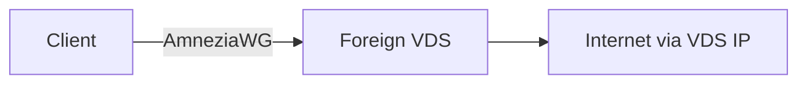
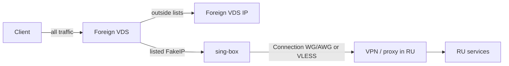
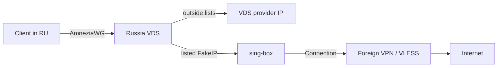
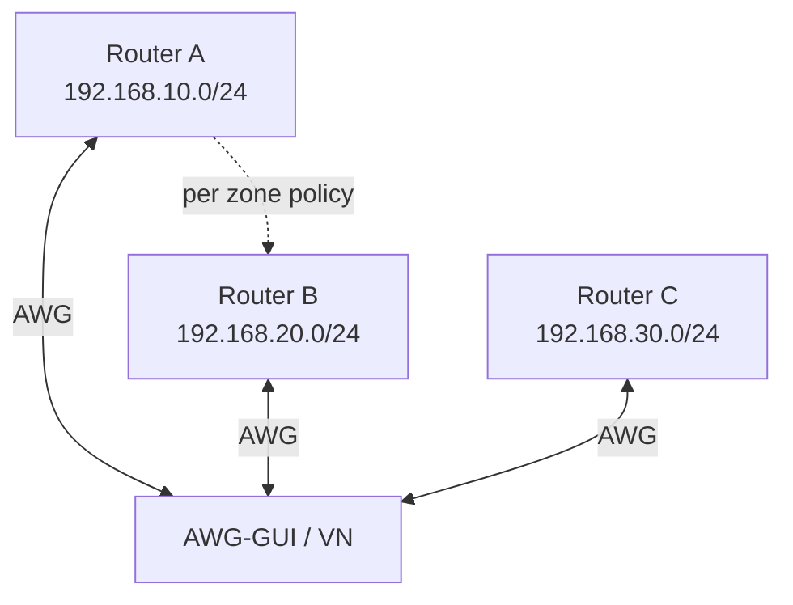

# Use cases

**Languages:** [Русский](../ru/use-cases.md) | [English](use-cases.md) | [README](../../README.en.md)

Typical AWG-GUI deployment patterns. Examples use **Server** and **Virtual network** configs, the [resolver](resolver.md), and [peers](configs-and-peers.md).

| # | Case | Where the panel runs | Resolver |
|---|------|----------------------|----------|
| 1 | [Server → client](#1-server--client) | Foreign VDS | Off |
| 2 | [Server → client + resolver (RU access)](#2-server--client--resolver-ru-access) | Foreign VDS | On → VPN in Russia |
| 3 | [Cascade server → client](#3-cascade-server--client) | Russia VDS | On → foreign VPN |
| 4 | [Virtual network hub](#4-virtual-network-hub) | Often Russia VDS | Off (VN) |
| 5 | [Home / office via a router](#5-home--office-via-a-router) | Any VDS | Optional |
| 6 | [Several roles on one panel](#6-several-roles-on-one-panel) | One VDS | Per config |

---

## 1. Server → client

Classic VPN: panel on a remote VDS (Finland, Netherlands, …); the user connects from a phone or PC as an AmneziaWG client.

| Item | Setup |
|------|--------|
| Config | Type **Server** |
| Resolver | Off |
| Client | `AllowedIPs = 0.0.0.0/0`, config default DNS |
| Check | 2ip.ru shows the VDS IP |

**When to use:** full-tunnel exit from a foreign server IP, no domain lists and no second hop.

→ [Configs & peers](configs-and-peers.md)

---

## 2. Server → client + resolver (RU access)

Panel on a **foreign** VDS. Default exit is that VDS IP. Russian services (banks, government, geo-restricted content) that break on a foreign IP leave via a **Connection** to a VPN/proxy in Russia.

| Item | Setup |
|------|--------|
| Config | **Server** on the foreign VDS |
| Resolver | On |
| List | **`russia_inside`** (not `russia_outside`) |
| Connection | WG/AWG `.conf` of a Russian server, or a VLESS/proxy that exits in Russia |
| Other traffic | Foreign VDS IP |

> **List names.** `russia_inside` is for domains/subnets that need an exit *from* Russia. `russia_outside` is for services blocked *inside* Russia — that belongs in [case 3](#3-cascade-server--client). The regional lists are mutually exclusive.

**After enabling** — re-import QR / `.conf` on the client (`DNS = gateway`, full tunnel).

→ [Resolver](resolver.md) · [WG/AWG connections](resolver.md#connections)

---

## 3. Cascade server → client

Panel on a **Russia** VDS. Clients connect to that server. The “normal” (RU) segment exits with the VDS provider IP. Selected lists (blocked services, YouTube, Meta, Telegram, …) take a **second hop** — foreign VPN or VLESS.

| Item | Setup |
|------|--------|
| Config | **Server** on a Russia VDS |
| Resolver | On |
| Lists | **`russia_outside`** and/or service lists (YouTube, Meta, Discord, Telegram, …) |
| Connection | Foreign WG/AWG, VLESS, subscription, or outbound JSON |
| RU segment | Sites outside lists → Russia VDS IP (banks/gov without an extra hop) |

**Why cascade:** one AmneziaWG entry for the client (Russia VDS), while blocked/heavy traffic uses a foreign outbound. For ABR video prefer [kernel AmneziaWG](install.md) on the host and a UDP-capable Connection.

→ [Resolver](resolver.md) (diagnostics and re-import)

---

## 4. Virtual network hub

The panel (often on a Russia VDS) runs a **Virtual network** config. N clients connect — typically **routers** (OpenWrt, Keenetic, …) or PCs. Each site/router advertises **its own** LAN subnet; subnets **must not overlap**.

| Item | Setup |
|------|--------|
| Config | Type **Virtual network** |
| Resolver | Not used |
| Router peer | **extra AllowedIPs** — exactly one LAN subnet, unique across peers (e.g. `192.168.10.0/24`) |
| Policy | “Allow all” or isolation + [zones / exclusions](virtual-networks.md) |
| Internet | **Not** routed via VN — only peer ↔ peer and their LANs |

**Typical goals:** link offices / home / cottage; give an admin access to several LANs; segment access with zones.

→ [Virtual networks](virtual-networks.md)

---

## 5. Home / office via a router

Same as case 1 or 3, but the client is a **router**, not a phone: the whole LAN exits through AWG-GUI.

| Item | Setup |
|------|--------|
| Config | **Server** (optionally with resolver as in case 2 or 3) |
| Client | Router with AmneziaWG / WireGuard |
| On the router | Policy routing / default via VPN — per router docs |
| Phone peers | Optional separate peers on the same config for mobile access bypassing the home router |

Unlike [case 4](#4-virtual-network-hub), the goal is **internet exit** via the VDS, not LAN↔LAN between sites.

---

## 6. Several roles on one panel

One VDS can host up to **20** configs with different ports, subnets, and protocol versions.

| Role | Example |
|------|---------|
| Server, no resolver | “Simple VPN” for guests |
| Server + resolver | “Smart” cascade config (case 2 or 3) |
| Virtual network | Office routers mesh (case 4) |
| Mixed AWG versions | One **1.5** config for older clients, another **2.0** |

Resolver is configured **per** server config (own lists and Connection). VN does not use the resolver.

→ [Configs & peers](configs-and-peers.md)

---

## Choosing a scheme

| Goal | Case |
|------|------|
| Just get a foreign IP | **1** |
| Live on a foreign VDS, but RU banks/services via Russia | **2** (`russia_inside`) |
| Live on a Russia VDS, blocked traffic via a foreign hop | **3** (`russia_outside` + services) |
| Link several LANs / routers without VPN internet | **4** |
| Whole home behind one VPN | **5** |
| Several jobs at once | **6** |

Routing details, MTU, QUIC, and diagnostics — [resolver.md](resolver.md).
