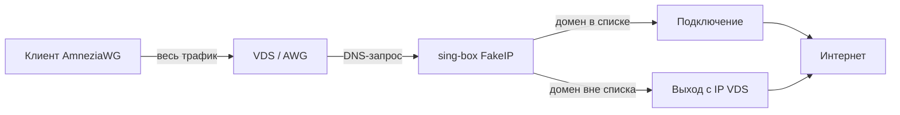

# Резолвер

**Языки:** [Русский](resolver.md) | [English](../en/resolver.md) | [README](../../README.md)

Страница **Резолвер** в панели AWG-GUI настраивает маршрутизацию для конфигов типа **Сервер**. Для [виртуальных сетей](virtual-networks.md) резолвер **не используется**.

Резолвер — это «умный VPN через VDS»: весь трафик клиента идёт на сервер (`AllowedIPs = 0.0.0.0/0`), а домены из выбранных списков выходят в интернет через отдельное **Подключение** (VLESS, VMess, подписка и т.п.), а не с IP VDS.

## Страницы в панели

| Страница | Назначение |
|----------|------------|
| **Резолвер** | Включение резолвера на серверном конфиге, выбор списков, своих доменов/CIDR, подключения, DNS upstream, блокировка QUIC |
| **Подключения** | Точки выхода в интернет для sing-box (outbound) |
| **Настройки списков** | Скачивание community ruleset-ов (`.srs`), интервал sync, свои списки |
| **Диагностика** | Проверка sing-box, ruleset-ов на диске, DNS → FakeIP |

## Как это работает

1. На VDS в контейнере AWG работает **sing-box** с FakeIP (`198.18.0.0/15`) и ruleset-списками.
2. Community-списки ([allow-domains](https://github.com/itdoginfo/allow-domains)) скачиваются на диск (`rulesets/*.srs`) — **Настройки списков**.
3. Для каждого серверного конфига на **Резолвере** выбирается **Подключение** — upstream для доменов из списков.
4. Клиент получает `.conf` / QR с `DNS = gateway` и `AllowedIPs = 0.0.0.0/0, ::/0`.



## Клиентский конфиг

При включённом резолвере в `.conf`:

```
DNS = <gateway>
AllowedIPs = 0.0.0.0/0, ::/0
```

`<gateway>` — адрес сервера в подсети AWG (например `10.66.66.1`).

## Маршрутизация трафика

| Трафик | Маршрут |
|--------|---------|
| Весь трафик клиента | Через AmneziaWG на VDS |
| Домены из списков (FakeIP) | sing-box → выбранное **Подключение** |
| Сайты вне списков, Speedtest, 2ip.ru | С **IP сервера VDS** |
| IP-CIDR из community-списков | Проксируются на VDS |
| Свои подсети (CIDR) | Учитываются на VDS в правилах sing-box |

Подходит, когда нужен классический «весь VPN через сервер», но заблокированные ресурсы (Telegram, YouTube, Meta…) выходят через отдельное upstream-подключение.

## Быстрая настройка

1. **Настройки списков** — скачайте нужные community-списки (или создайте свои).
2. **Подключения** — добавьте и проверьте точку выхода (VLESS / подписка / …).
3. **Резолвер** — раскройте серверный конфиг:
   - включите резолвер;
   - выберите **Подключение**;
   - отметьте хотя бы один список, свой домен или подсеть;
   - при необходимости задайте DNS upstream и «Блокировать QUIC»;
   - нажмите **Сохранить**.
4. На телефоне **удалите** старый сервер в AmneziaWG и **заново импортируйте** QR / `.conf`.

Без переимпорта клиент может остаться со старыми `DNS` / `AllowedIPs` — списки не заработают.

## Списки

- **Community-списки** — YouTube, Meta, Telegram, Discord, TikTok и др. Синхронизация в **Настройки списков** (интервал по умолчанию 6 ч). Кнопка **Сохранить** на странице Резолвер **не** скачивает списки по HTTP.
- **Свои домены и подсети** — на карточке конфига на странице **Резолвер**.
- **Взаимоисключающие списки** — `russia_inside`, `russia_outside`, `ukraine_inside`: одновременно можно выбрать только один из этой группы.
- **Блокировать QUIC** — форсирует TCP для FakeIP-доменов (UDP/443), полезно для YouTube и других сервисов из списков.

## Подключения

Резолвер **не применяется** без выбранного и включённого подключения. Создайте подключение на странице **Подключения**, затем укажите его в настройках конфига.

## Проверка на телефоне

| Проверка | Ожидаемый результат |
|----------|---------------------|
| 2ip.ru | IP **VDS**, не клиента |
| Сайт / приложение из списка | Работает через VPN-подключение |
| `DNS` в `.conf` | `gateway` сервера |
| `AllowedIPs` | `0.0.0.0/0, ::/0` |
| Private DNS (Android) | Выключен |
| iCloud Private Relay (iPhone) | Выключен на время проверки |

Не проверяйте работу списков через Speedtest — откройте конкретный сайт или приложение из выбранного списка.

## Диагностика и типичные проблемы

- Страница **Диагностика** — sing-box, `.srs` на диске, DNS → FakeIP для включённых списков.
- **Android:** отключите Private DNS / DoH; при сбоях Telegram — очистите кэш приложения.
- **iPhone:** отключите iCloud Private Relay.
- Убедитесь, что community-списки скачаны (**Настройки списков** → «На диске»).
- После смены endpoint, порта UDP или настроек резолвера — переэкспортируйте / переимпортируйте конфиги на устройствах.

## sing-box в образе AWG

Резолвер использует [sing-box](https://github.com/SagerNet/sing-box) внутри контейнера AWG. В production-сборке sing-box уже включён в образ; при dev-сборке tarball скачивается установщиком — см. [install.md](install.md#sing-box-vendor-только-dev-сборка).

Подробности лицензии и брендинга sing-box — в [README](../../README.md#sing-box-и-брендинг) и [NOTICE.md](../../NOTICE.md).
