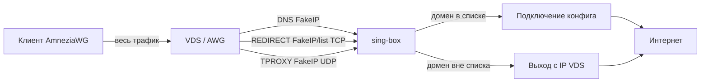

# Резолвер

**Языки:** [Русский](resolver.md) | [English](../en/resolver.md) | [README](../../README.md)

Страница **Резолвер** в панели AWG-GUI настраивает маршрутизацию для конфигов типа **Сервер**. Для [виртуальных сетей](virtual-networks.md) резолвер **не используется**.

Резолвер — это «умный VPN через VDS»: весь трафик клиента идёт на сервер (`AllowedIPs = 0.0.0.0/0`), а домены из выбранных списков выходят в интернет через отдельное **Подключение** (VLESS, VMess, подписка, outbound JSON или **WG/AWG**), а не с IP VDS.

## Страницы в панели

| Страница | Назначение |
|----------|------------|
| **Резолвер** | Включение резолвера на серверном конфиге, выбор списков, своих доменов/CIDR, подключения, DNS upstream, блокировка QUIC |
| **Подключения** | Точки выхода в интернет для sing-box (outbound) |
| **Настройки списков** | Скачивание community ruleset-ов (`.srs`), интервал sync, свои списки |
| **Диагностика** | Проверка sing-box, ruleset-ов на диске, DNS → FakeIP, datapath AWG (kernel/userspace), сессий FakeIP UDP/QUIC |

## Как это работает

1. На VDS в контейнере AWG работает **sing-box** с FakeIP (`198.18.0.0/15`) и ruleset-списками. TCP к FakeIP/list доставляется через **NAT REDIRECT** на `:1602` (Docker-safe); UDP к FakeIP — через **TPROXY** `:1603`. Если **Блокировать QUIC** включён — sing-box отклоняет `protocol=quic` (клиент падает на TCP); выключен — QUIC/HTTP3 идёт через Подключение.
2. Community-списки ([allow-domains](https://github.com/itdoginfo/allow-domains)) скачиваются на диск (`rulesets/*.srs`) — **Настройки списков**.
3. Для каждого серверного конфига на **Резолвере** выбирается **Подключение** — upstream для доменов из списков. Несколько AWG-конфигов изолируются по VPN-подсети клиента (`source_ip_cidr`): свои списки, outbound, DNS и флаг Block QUIC.
4. Клиент получает `.conf` / QR с `DNS = gateway`, `AllowedIPs = 0.0.0.0/0, ::/0` и **MTU = 1420** (после смены MTU нужен переимпорт на устройстве).
5. Для ABR-видео (YouTube/Instagram) на полном туннеле нужен **kernel AmneziaWG** на хосте VDS (инсталлер или **Настройки → Панель**); без модуля — userspace `amneziawg-go`. Kernel необходим, но недостаточен: для 1080p/1440p также нужен живой QUIC (Block QUIC выкл + UDP-capable outbound) или устойчивый TCP-path.


```mermaid
flowchart LR
  Client[Клиент AmneziaWG] -->|весь трафик| VDS[VDS / AWG]
  VDS -->|DNS FakeIP| SB[sing-box]
  VDS -->|REDIRECT FakeIP/list TCP| SB
  VDS -->|TPROXY FakeIP UDP| SB
  SB -->|домен в списке| Conn[Подключение конфига]
  SB -->|домен вне списка| VDSip[Выход с IP VDS]
  Conn --> Internet[Интернет]
  VDSip --> Internet
```

## Клиентский конфиг

При включённом резолвере в `.conf`:

```
DNS = <gateway>
AllowedIPs = 0.0.0.0/0, ::/0
```

`<gateway>` — адрес сервера в подсети AWG (например `10.66.66.1`).

## Маршрутизация трафика

| Трафик | Маршрут |
|--------|---------|
| Весь трафик клиента | Через AmneziaWG на VDS |
| Домены из списков (FakeIP) | sing-box → выбранное **Подключение** |
| Сайты вне списков, Speedtest, 2ip.ru | С **IP сервера VDS** |
| IP-CIDR из community-списков | Проксируются на VDS |
| Свои подсети (CIDR) | Учитываются на VDS в правилах sing-box |

Подходит, когда нужен классический «весь VPN через сервер», но заблокированные ресурсы (Telegram, YouTube, Meta…) выходят через отдельное upstream-подключение.

Типовые схемы (зарубежная VDS + `russia_inside`, РФ VDS-каскад + `russia_outside`, …) — в [кейсах использования](use-cases.md).

## Быстрая настройка

1. **Настройки списков** — скачайте нужные community-списки (или создайте свои).
2. **Подключения** — добавьте и проверьте точку выхода (VLESS / подписка / JSON / WG·AWG).
3. **Резолвер** — раскройте серверный конфиг:
   - включите резолвер;
   - выберите **Подключение**;
   - при необходимости отметьте списки, свои домены или подсети;
   - при необходимости задайте DNS upstream и «Блокировать QUIC»;
   - нажмите **Сохранить**.
4. На телефоне **удалите** старый сервер в AmneziaWG и **заново импортируйте** QR / `.conf`.

Если у пиров конфига заданы свои AllowedIPs (split-tunnel без резолвера), при включении резолвера панель покажет **диалог подтверждения**: клиентские AllowedIPs станут `0.0.0.0/0, ::/0`, ограничение по CIDR перестанет действовать, пока резолвер включён; пирам нужен переимпорт. Без кастомных CIDR у пиров диалог не показывается.

Без переимпорта клиент может остаться со старыми `DNS` / `AllowedIPs` — списки не заработают.

## Списки

- **Community-списки** — YouTube, Meta, Telegram, Discord, TikTok и др. Синхронизация в **Настройки списков** (интервал по умолчанию 6 ч). Кнопка **Сохранить** на странице Резолвер **не** скачивает списки по HTTP.
- **Свои домены и подсети** — на карточке конфига на странице **Резолвер**.
- **Взаимоисключающие списки** — `russia_inside`, `russia_outside`, `ukraine_inside`: одновременно можно выбрать только один из этой группы.
- **Блокировать QUIC** — включено: sing-box отклоняет sniffed QUIC для этой VPN-подсети (приложения на TCP; помогает на части Android YouTube). Выключено: QUIC/HTTP3 идёт через Подключение (лучше для YouTube 4K; нужен UDP-capable outbound, например VLESS+XUDP). UDP FakeIP всегда доставляется в sing-box через TPROXY — галочка не рубит весь UDP. Не влияет на другие AWG-конфиги на той же VDS. **Замер скорости** в панели — bulk через outbound, это не то же самое, что ABR-видео / перемотка. Для видео по возможности выбирайте ноды без WebSocket/gRPC (TCP/Reality), если подписка позволяет.

## Подключения

Резолвер **не применяется** без выбранного и включённого подключения. Создайте подключение на странице **Подключения**, затем укажите его в настройках конфига.

Типы подключений:

| Тип | Что указать |
|-----|-------------|
| **Прокси / подписка** | URI или URL подписки (VLESS, VMess и др.) |
| **JSON** | Объект outbound sing-box без поля `tag` |
| **WG/AWG** | Текст или файл удалённого `.conf` AmneziaWG / WireGuard и **версия протокола**, совпадающая с удалённым сервером |

Для **WG/AWG** панель разбирает `.conf` (`[Interface]` / `[Peer]`, включая параметры обфускации) и поднимает exit-туннель (`awgc…`) для sing-box. Версии AmneziaWG **несовместимы** между собой — укажите ту же, что на удалённом сервере (1.0 / 1.5 / 2.0 / 3.1).

## Проверка на телефоне

| Проверка | Ожидаемый результат |
|----------|---------------------|
| 2ip.ru | IP **VDS**, не клиента |
| Сайт / приложение из списка | Работает через VPN-подключение |
| `DNS` в `.conf` | `gateway` сервера |
| `AllowedIPs` | `0.0.0.0/0, ::/0` |
| Private DNS (Android) | Выключен |
| iCloud Private Relay (iPhone) | Выключен на время проверки |

Не проверяйте работу списков через Speedtest — откройте конкретный сайт или приложение из выбранного списка.

## Диагностика и типичные проблемы

- Страница **Диагностика** — sing-box, `.srs` на диске, DNS → FakeIP для включённых списков, **datapath AWG** (kernel vs userspace `amneziawg-go`) и **сессии FakeIP UDP / QUIC** (хиты TPROXY vs UDP-соединения Clash).
- **Userspace datapath** — ABR YouTube/Instagram будет дёргаться; установите kernel-модуль (**Настройки → Панель**) и убедитесь, что Диагностика показывает `datapath=kernel`.
- **UDP-хиты есть, а Clash UDP-сессий нет** — скорее всего мёртв QUIC/FakeIP reverse: переподключите VPN на телефоне, **Сохраните** резолвер, выключите **Блокировать QUIC**, используйте UDP-capable Подключение (например VLESS + XUDP). TCP-path при этом может работать.
- **Android:** отключите Private DNS / DoH; при сбоях Telegram — очистите кэш приложения.
- **iPhone:** отключите iCloud Private Relay.
- Убедитесь, что community-списки скачаны (**Настройки списков** → «На диске»).
- После смены endpoint, порта UDP или настроек резолвера — переэкспортируйте / переимпортируйте конфиги на устройствах.

## sing-box в образе AWG

Резолвер использует [sing-box](https://github.com/SagerNet/sing-box) **1.13.x** внутри контейнера AWG (версия зафиксирована в `src/awg/Dockerfile`). Sniff настроен на уровне **route**; устаревшие inbound-поля `sniff_*` снимаются при сохранении, чтобы `sing-box check` не отклонял конфиг. В production-сборке sing-box уже включён в образ; при dev-сборке tarball скачивается установщиком — см. [install.md](install.md#sing-box-vendor-только-dev-сборка).

Подробности лицензии и брендинга sing-box — в [README](../../README.md#sing-box-и-брендинг) и [NOTICE.md](../../NOTICE.md).
