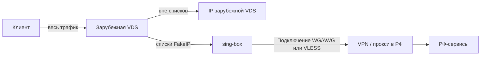
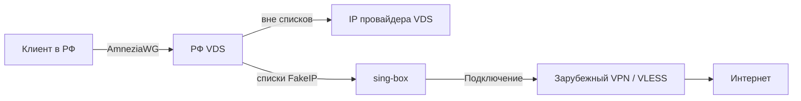
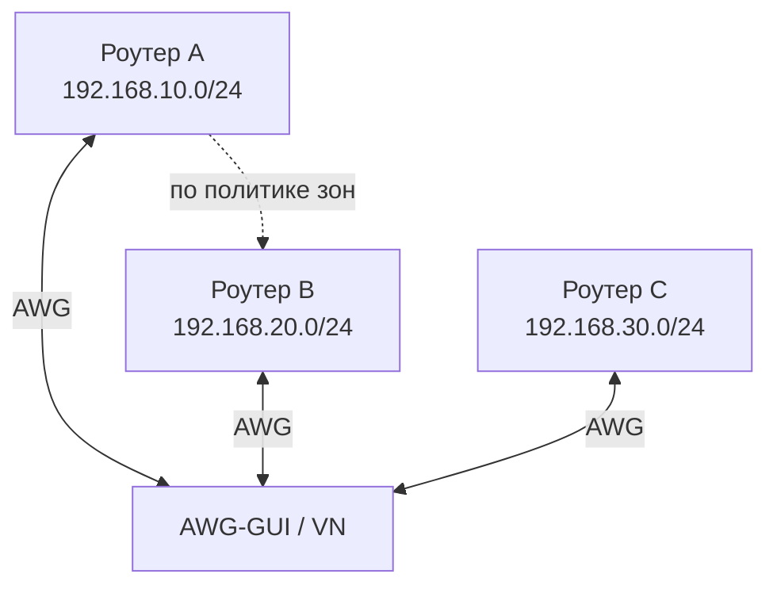

# Кейсы использования

**Языки:** [Русский](use-cases.md) | [English](../en/use-cases.md) | [README](../../README.md)

Типовые схемы развёртывания AWG-GUI. Все примеры опираются на конфиги типа **Сервер** и **Виртуальная сеть**, [резолвер](resolver.md) и [пиры](configs-and-peers.md).

| # | Кейс | Где панель | Резолвер |
|---|------|------------|----------|
| 1 | [Сервер → клиент](#1-сервер--клиент) | Зарубежная VDS | Нет |
| 2 | [Сервер → клиент + резолвер (доступ к РФ)](#2-сервер--клиент--резолвер-доступ-к-рф) | Зарубежная VDS | Да → VPN в РФ |
| 3 | [Сервер-каскад → клиент](#3-сервер-каскад--клиент) | РФ VDS | Да → зарубежный VPN |
| 4 | [Сервер виртуальных сетей](#4-сервер-виртуальных-сетей) | Обычно РФ VDS | Нет (VN) |
| 5 | [Дом / офис через роутер](#5-дом--офис-через-роутер) | Любая VDS | Опционально |
| 6 | [Несколько ролей на одной панели](#6-несколько-ролей-на-одной-панели) | Одна VDS | По конфигам |

---

## 1. Сервер → клиент

Классический VPN: панель на удалённой VDS (Финляндия, Нидерланды, …), пользователь подключается с телефона / ПК как клиент AmneziaWG.


| Что | Настройка |
|-----|-----------|
| Конфиг | Тип **Сервер** |
| Резолвер | Выключен |
| Клиент | `AllowedIPs = 0.0.0.0/0`, DNS по умолчанию конфига |
| Проверка | 2ip.ru показывает IP VDS |

**Когда подходит:** нужен простой выход «весь трафик с IP зарубежного сервера», без списков и второго hop.

### Вариант: доступ только к выбранным CIDR (split-tunnel)

Резолвер **выключен**. В карточке пира укажите CIDR в **«Маршруты клиента через VPN»** (например любой хост/подсеть за сервером). В клиентском `.conf` будет подсеть туннеля + эти CIDR, **без** `0.0.0.0/0`:

```
AllowedIPs = 10.66.66.0/24, 192.168.10.5/32
DNS = 1.1.1.1
```

На **сервере** у пира в AllowedIPs остаётся только tunnel IP пира — иначе маршрут к цели уйдёт обратно в туннель. Через VPN — указанные ресурсы и подсеть AWG; обычный интернет и DNS — мимо туннеля. Цель должна пинговаться из контейнера `awggui-awg`. Подробнее — [конфиги и пиры](configs-and-peers.md#allowedips-для-типа-сервер).

→ [Конфиги и пиры](configs-and-peers.md)

---

## 2. Сервер → клиент + резолвер (доступ к РФ)

Панель на **зарубежной** VDS. Основной выход — IP этой VDS. Российские сервисы (банки, госуслуги, гео-ограниченный контент), которые плохо работают с иностранного IP, уходят через **Подключение** на VPN/прокси в РФ.



| Что | Настройка |
|-----|-----------|
| Конфиг | Тип **Сервер** на зарубежной VDS |
| Резолвер | Включён |
| Список | **`russia_inside`** (не `russia_outside`) |
| Подключение | WG/AWG `.conf` российского сервера, либо VLESS/прокси с выходом в РФ |
| Остальной трафик | С IP зарубежной VDS |

> **Имя списка.** `russia_inside` — домены/подсети, которым нужен выход *из* РФ. `russia_outside` — сервисы, заблокированные *в* РФ; его используют в [кейсе 3](#3-сервер-каскад--клиент). Списки взаимоисключающие.

**После включения** — переимпорт QR / `.conf` на клиенте (`DNS = gateway`, полный туннель).

Если у пиров уже были свои CIDR (split-tunnel), панель покажет **диалог подтверждения**: после включения резолвера клиентские AllowedIPs станут `0.0.0.0/0, ::/0`, ограничение по CIDR перестанет действовать, пока резолвер включён.

→ [Резолвер](resolver.md) · [Подключения WG/AWG](resolver.md#подключения)

---

## 3. Сервер-каскад → клиент

Панель на **РФ** VDS. Клиент ходит на этот сервер. «Обычный» (RU) сегмент выходит в интернет с IP провайдера VDS. Выбранные списки (заблокированные сервисы, YouTube, Meta, Telegram, …) уходят во **второй hop** — зарубежный VPN или VLESS.



| Что | Настройка |
|-----|-----------|
| Конфиг | Тип **Сервер** на РФ VDS |
| Резолвер | Включён |
| Списки | **`russia_outside`** и/или сервисы (YouTube, Meta, Discord, Telegram, …) |
| Подключение | Зарубежный WG/AWG, VLESS, подписка или outbound JSON |
| RU-сегмент | Сайты вне списков → IP РФ VDS (банки, госуслуги без лишнего hop) |

**Зачем каскад:** один вход для клиента (РФ VDS + AmneziaWG), а тяжёлые/заблокированные ресурсы — через зарубежный outbound. Для ABR-видео желателен [kernel AmneziaWG](install.md) на хосте и UDP-capable Подключение.

При включении резолвера на конфиге, где у пиров были кастомные AllowedIPs, появится тот же **диалог подтверждения**, что в [кейсе 2](#2-сервер--клиент--резолвер-доступ-к-рф): полный туннель + переимпорт.

→ [Резолвер](resolver.md) · диагностика и переимпорт там же

---

## 4. Сервер виртуальных сетей

Панель (часто на РФ VDS) поднимает конфиг **Виртуальная сеть**. К нему подключаются N клиентов — обычно **роутеры** (OpenWrt, Keenetic, …) или ПК. Каждый сайт/роутер объявляет **свою** LAN-подсеть; подсети **не должны пересекаться**.



| Что | Настройка |
|-----|-----------|
| Конфиг | Тип **Виртуальная сеть** |
| Резолвер | Не используется |
| Пир-роутер | В **extra AllowedIPs** — ровно одна LAN-подсеть, уникальная среди всех пиров (например `192.168.10.0/24`) |
| Политика | «Все видят всех» или изоляция + [зоны / исключения](virtual-networks.md) |
| Интернет | Через VN **не** маршрутизируется — только связность между пирами и их LAN |

**Типичные задачи:** связать офисы, дачу и дом; дать админу доступ к нескольким LAN; сегментировать доступ зонами (бухгалтерия не видит склад и наоборот).

→ [Виртуальные сети](virtual-networks.md)

---

## 5. Дом / офис через роутер

Вариант кейса 1 или 3, но клиент — **роутер**, а не телефон: вся домашняя/офисная сеть выходит через AWG-GUI.

| Что | Настройка |
|-----|-----------|
| Конфиг | **Сервер** (при необходимости с резолвером как в кейсе 2 или 3) |
| Клиент | Роутер с AmneziaWG / WireGuard |
| На роутере | Policy routing / default via VPN — по документации роутера |
| Пиры на телефонах | Опционально: отдельные пиры того же конфига для мобильного доступа в обход домашнего роутера |

Отличие от [кейса 4](#4-сервер-виртуальных-сетей): здесь цель — **выход в интернет** через VDS, а не LAN↔LAN между площадками.

---

## 6. Несколько ролей на одной панели

На одной VDS можно держать до **20** конфигов с разными портами, подсетями и версиями протокола.

| Роль | Пример |
|------|--------|
| Сервер без резолвера | «Простой VPN» для гостей |
| Сервер + резолвер | «Умный» конфиг с каскадом (кейс 2 или 3) |
| Виртуальная сеть | Связка офисных роутеров (кейс 4) |
| Разные версии AWG | Один конфиг **1.5** для старых клиентов, другой **2.0** |

Резолвер настраивается **на каждый** серверный конфиг отдельно (свои списки и Подключение). VN резолвер не использует.

→ [Конфиги и пиры](configs-and-peers.md)

---

## Как выбрать схему

| Цель | Кейс |
|------|------|
| Просто сменить IP на зарубежный | **1** |
| Доступ только к выбранным IP/подсетям (без полного туннеля) | **1** (split-tunnel) |
| Жить на зарубежной VDS, но банки/РФ-сервисы через РФ | **2** (`russia_inside`) |
| Жить на РФ VDS, заблокированное — через зарубежный hop | **3** (`russia_outside` + сервисы) |
| Связать несколько LAN / роутеров без VPN-интернета | **4** |
| Весь дом за одним VPN | **5** |
| Несколько задач сразу | **6** |

Подробности маршрутизации списков, MTU, QUIC и диагностики — в [resolver.md](resolver.md).
